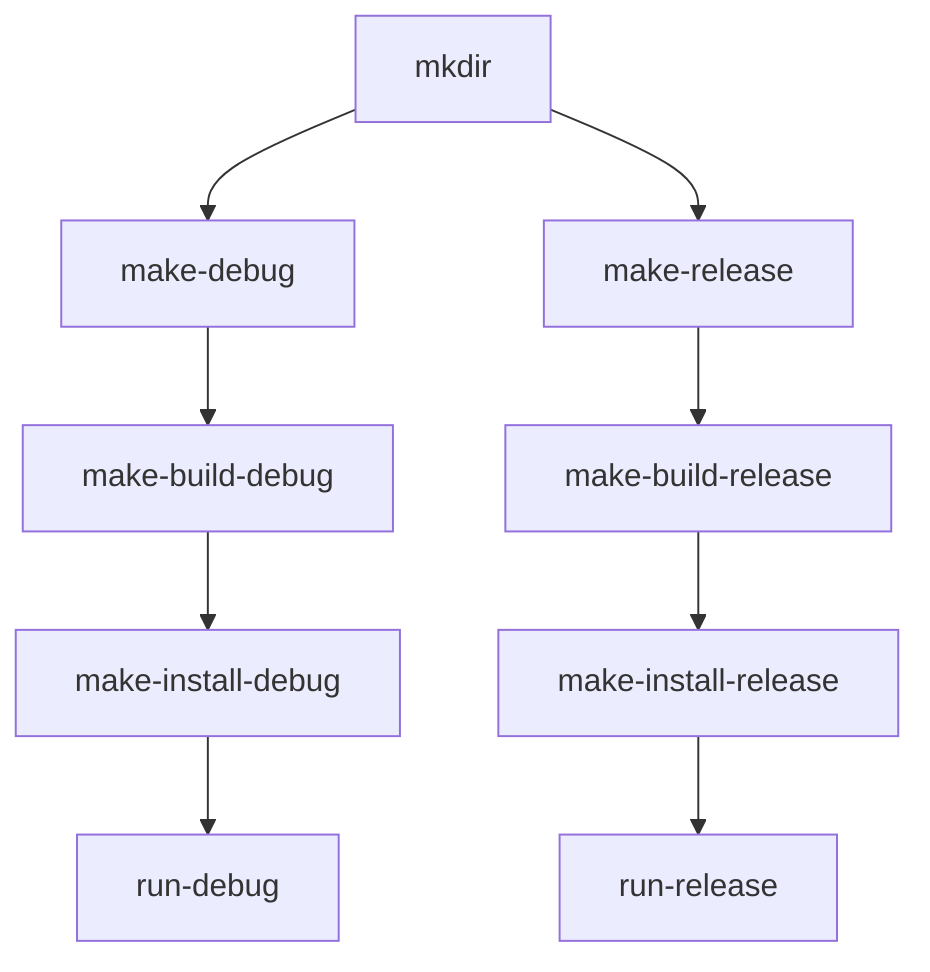

# IntMusic

## 简介

基于QT开发的桌面播放器。

## Todo
- [x] 有一个基本的界面
- [x] 音乐库
    - [x] 支持添加和读取单个音乐文件到数据库
    - [ ] 支持批量
    - [ ] 支持修改和更新
- [x] 音频格式支持
    - [x] flac、mp3
    - [ ] dsf、dff
- [x] 正常解析以上音频文件的tag
- [ ] 支持逐字歌词
- [ ] 支持读取百度网盘和阿里云盘的音乐
- [ ] 支持智能歌单
- [ ] 支持年度报告
- [ ] 支持DLNA

## 开发（VS Code）


### 下载

```powershell
git clone https://github.com/int233/MusicPlayer.git
cd MusicPlayer
git checkout QT
```

### 编译

- [tasks.json 文件](.vscode/tasks.json)中存在debug和release两条构建链：



- [launch.json 文件](.vscode/launch.json)利用[tasks.json](.vscode/tasks.json)中的`make-install-debug`生成应用程序并调试。